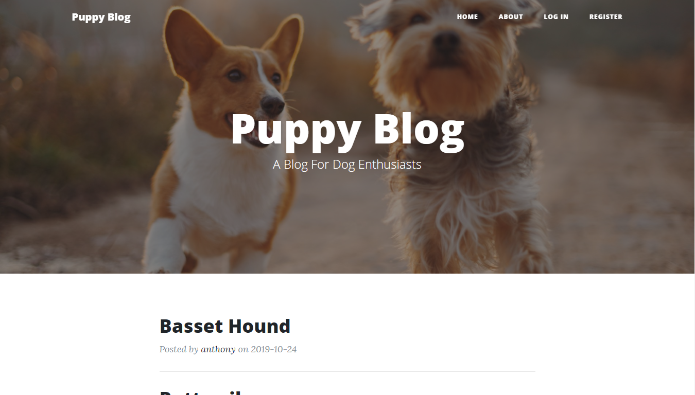
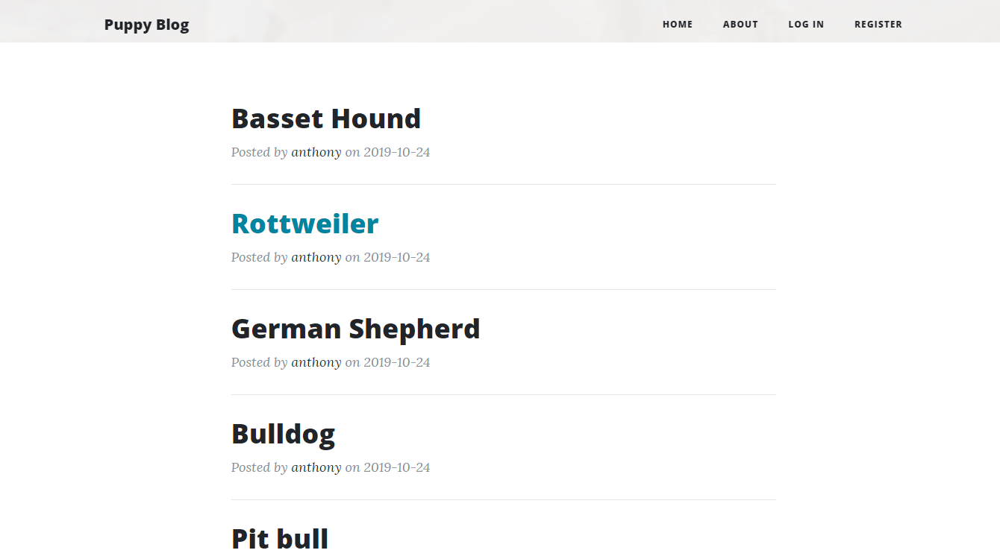
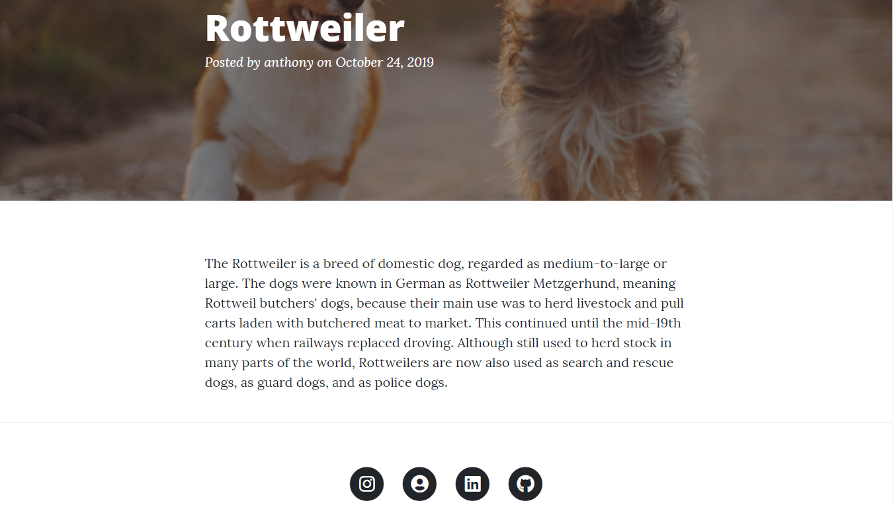
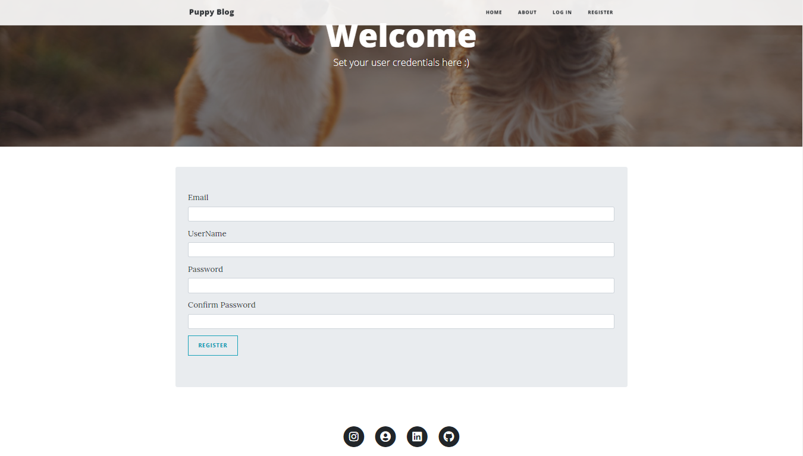
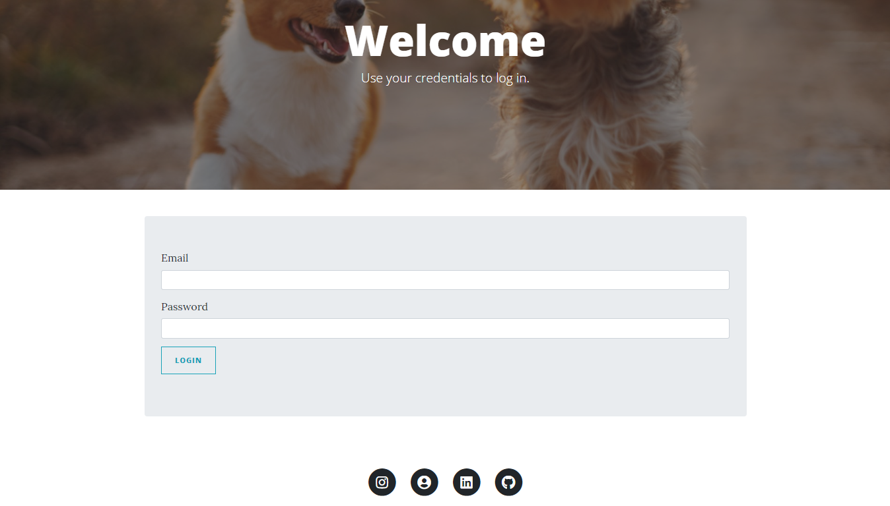

# Puppy Blog
Built upon a Pierian Data tutorial

The requirements listed are the ones I used at the time. Update the dependencies to prevent vulnerabilities
#
## Some of the Technologies used are:
* Python
* Flask
* HTML/CSS/JS
* Bootstrap

#
Home

Home2

Post

Register

login

